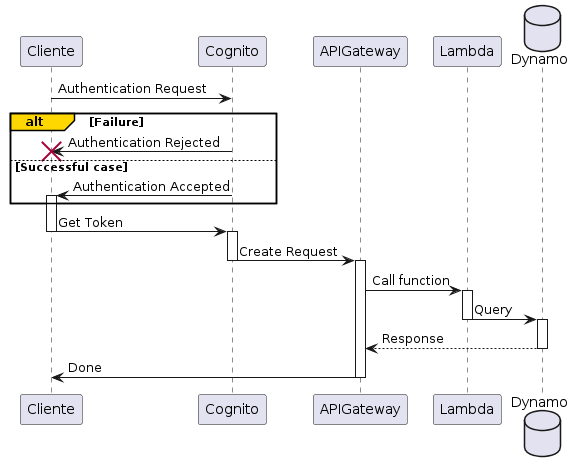

# documentación Assesment Pragma 2024

## Introducción

La solución propuesta está diseñada para proporcionar una plataforma integral y eficiente para la gestión de proyectos de construcción y la venta de unidades de vivienda. Aprovechando los servicios avanzados de AWS, la arquitectura está orientada a ofrecer escalabilidad, alta disponibilidad, flexibilidad y seguridad. La plataforma está orientada a mejorar tanto la experiencia del cliente como la eficiencia operativa, permitiendo una gestión efectiva de todos los aspectos del proceso constructivo y comercial.

### Escalabilidad
Capaz de manejar un creciente volumen de datos y usuarios sin afectar el rendimiento.
### Disponibilidad Continua
Con alta disponibilidad y tolerancia a fallos, el sistema está disponible 24/7.
### Flexibilidad
La arquitectura basada en microservicios permite actualizaciones y mejoras rápidas.
### Seguridad
Gestión robusta de usuarios y permisos, asegurando datos sensibles y operaciones seguras.

Esta solución integral combina la potencia y flexibilidad de los servicios de AWS para ofrecer una plataforma robusta y escalable que optimiza la gestión de proyectos de construcción y la venta de unidades de vivienda. La arquitectura basada en microservicios asegura una escalabilidad eficiente, alta disponibilidad, y capacidad para adaptarse rápidamente a las necesidades cambiantes. Además, la seguridad robusta protege los datos y operaciones, mientras que las herramientas de monitoreo aseguran un rendimiento continuo y fiable. Con esta solución, la empresa constructora puede mejorar la experiencia del cliente, aumentar la eficiencia operativa y mantener una ventaja competitiva en el mercado.

#### <a href="collection/AssesmentPRAGMA2024.postman_collection.json" download>Descargar colección Postman</a>
A continuacion se relacionara cada API/servicio que se implemento
## APIs

### [* ProyectosAPI](doc/Proyectos/Readme.md "ver capacidad")

La API de Proyectos está diseñada para gestionar información relacionada con proyectos de construcción. Permite realizar operaciones CRUD (Crear, Leer, Actualizar, Eliminar) sobre los datos de los proyectos almacenados en un sistema de base de datos.
#### [Ver Swagger](doc/Proyectos/contrato/API_Proyectos.yaml "ver capacidad")

### [* UnidadesAPI](doc/Unidades/Readme.md "ver capacidad")

La API de Unidades permite la gestión integral de unidades de vivienda, facilitando la creación, consulta, actualización y eliminación de registros en una tabla DynamoDB dedicada. Esta API es esencial para administrar el inventario de unidades en proyectos residenciales y comerciales, asegurando un manejo eficiente y accesible de la información relevante para cada unidad.
#### [Ver Swagger](doc/Unidades/contrato/API_Unidades.yaml "ver capacidad")

### [* RecursosAPI](doc/Recursos/Readme.md "ver capacidad")

La API de Recursos está diseñada para gestionar los recursos asociados a proyectos, como materiales, personal y maquinaria. Permite realizar operaciones CRUD (crear, leer, actualizar y eliminar) sobre los recursos almacenados en DynamoDB, garantizando un control preciso y actualizado del inventario disponible para su asignación en distintos proyectos. 
#### [Ver Swagger](doc/Recursos/contrato/API_Recursos.yaml "ver capacidad")

### [* VentasReservasAPI](doc/VentasReservas/Readme.md "ver capacidad")

La API de Ventas y Reservas permite gestionar transacciones relacionadas con la venta y reserva de unidades de vivienda. Facilita la creación, consulta, actualización y eliminación de registros de ventas y reservas en DynamoDB, permitiendo el seguimiento del estado de las transacciones, la asignación de unidades y la gestión de comisiones asociadas a cada operación.
#### [Ver Swagger](doc/VentasReservas/contrato/API_VentasReservas.yaml "ver capacidad")

### [* ClientesAPI](doc/Clientes/Readme.md "ver capacidad")

La API de Clientes permite gestionar la información de los clientes en el sistema. Ofrece operaciones para crear, consultar, actualizar y eliminar registros de clientes en DynamoDB. Facilita la administración de datos como nombre, correo electrónico, teléfono, dirección, fecha de nacimiento, documento de identificación y tipo de cliente.
#### [Ver Swagger](doc/Clientes/contrato/API_Cliente.yaml "ver capacidad")

## Funcionalidad

A continuación se describe detalladamente cómo funciona la solución mediante un diagrama de secuencia:

Este diagrama de secuencia ilustra el proceso completo de autenticación y manejo de solicitudes en un sistema que integra AWS Cognito, API Gateway, Lambda y DynamoDB.

### Solicitud de Autenticación:

- El proceso comienza cuando el cliente envía una solicitud de autenticación a AWS Cognito.

### Validación de la Autenticación:

- Si la autenticación no es válida, Cognito rechaza la solicitud, finalizando el proceso.

- En caso de que la autenticación sea exitosa, Cognito genera un token y lo envía de vuelta al cliente.

### Creación y Envío de la Solicitud:

- Con el token recibido, el cliente construye una solicitud y la envía a través de API Gateway.

### Invocación de la Función Lambda:

- API Gateway recibe la solicitud y llama a una función Lambda que maneja la lógica de negocio.

- La función Lambda interactúa con DynamoDB para consultar o actualizar los datos necesarios.

### Respuesta:

- DynamoDB devuelve el resultado de la consulta a la función Lambda, que procesa la información y la devuelve a API Gateway.

- Finalmente, API Gateway envía la respuesta al cliente.

Este proceso asegura que solo los clientes autenticados puedan acceder a los recursos protegidos, permitiendo una comunicación segura y controlada entre los servicios AWS involucrados.

## Modelo de Arquitectura

El diagrama presentado muestra una arquitectura orientada a servicios dentro del ecosistema AWS, diseñada para proporcionar una solución segura, escalable y de alto rendimiento. Esta arquitectura es el resultado de una planificación estratégica para maximizar la eficiencia y la seguridad en la gestión de recursos y datos.

### Autenticación y Autorización (Cognito)
- Rol: AWS Cognito se encarga de asegurar que solo los usuarios autenticados pueden interactuar con la aplicación.

- Proceso: Los usuarios envían sus credenciales, y Cognito verifica su autenticidad, proporcionando tokens de acceso que se utilizan para autorizar las solicitudes a través de la API Gateway.

### Gestión del Tráfico y Enrutamiento (API Gateway)
- Rol: API Gateway actúa como un proxy centralizado, recibiendo y distribuyendo las solicitudes a los servicios correspondientes.

- Proceso: Una vez que las solicitudes son autenticadas por Cognito, API Gateway enruta las peticiones al servicio adecuado (Lambda) basado en el endpoint al que se dirige la solicitud. Esta capa también ofrece control de acceso y protección contra ataques DDoS.

### Ejecución de Lógica de Negocio (Lambda)
- Rol: AWS Lambda es el motor de la lógica de negocio. Permite ejecutar funciones en respuesta a eventos sin necesidad de gestionar servidores.

- Proceso: Cada vez que una solicitud llega a API Gateway, Lambda ejecuta la lógica necesaria para procesar la solicitud, ya sea consultando datos, modificándolos, o interactuando con otros servicios AWS. Los permisos son gestionados cuidadosamente a través de políticas IAM para garantizar que Lambda solo tenga acceso a los recursos necesarios.

### Almacenamiento Persistente (DynamoDB)
- Rol: DynamoDB es el almacén de datos de la solución, utilizado para gestionar datos de manera escalable y de alta disponibilidad.

- Proceso: Lambda interactúa con DynamoDB para realizar operaciones CRUD, asegurando que la información esté almacenada y accesible según sea necesario, manteniendo la consistencia y rendimiento.

### Monitoreo y Observabilidad (CloudWatch)
- Rol: AWS CloudWatch proporciona capacidades de monitoreo integral, recolectando métricas y logs de cada componente de la arquitectura.

- Proceso: CloudWatch rastrea el comportamiento de los recursos en tiempo real, emite alertas en caso de anomalías, y ofrece dashboards visuales que permiten al equipo de desarrollo y operaciones tomar decisiones informadas rápidamente. Esto asegura que la solución opere de manera óptima y cualquier problema sea detectado y resuelto con prontitud.

La arquitectura implementada en AWS, como se detalla en el diagrama, ofrece una solución integral y optimizada que equilibra seguridad, escalabilidad y rendimiento, adaptándose de manera efectiva a las demandas de la aplicación. Cada componente de la arquitectura desempeña un rol crucial y está cuidadosamente integrado para proporcionar un sistema cohesivo y eficiente, asegurando que la solución no solo cumple con los requisitos funcionales, sino que también está optimizada para la escalabilidad, seguridad y monitoreo continuo.

## Observabilidad

En la solución implementada, AWS CloudWatch juega un papel fundamental en la observabilidad y el monitoreo continuo del sistema. Proporciona un conjunto completo de herramientas para capturar y analizar métricas clave, así como para realizar un seguimiento en tiempo real del rendimiento de los recursos y las aplicaciones.

CloudWatch permite la creación de dashboards personalizados, donde se visualiza de manera centralizada el progreso del proyecto, el uso de recursos y el rendimiento financiero, proporcionando a los administradores una vista integral de la salud del sistema. Además, la configuración de alarmas y notificaciones automatiza la detección de problemas y la notificación a los equipos responsables, garantizando una respuesta oportuna a cualquier incidente.

## Seguridad

La configuración de seguridad en esta solución se basa en dos componentes clave: la autenticación mediante AWS Cognito y la autorización mediante permisos IAM.

### Autenticación con AWS Cognito
Para proteger el acceso a las APIs desarrolladas, se implementó AWS Cognito como mecanismo de autenticación. Un User Pool de Cognito gestiona las identidades de los usuarios, proporcionando funciones como el registro, inicio de sesión y recuperación de contraseñas. En API Gateway, se configuró un autorizador de tipo Cognito que asocia este User Pool con las diferentes APIs. Esto asegura que solo los usuarios autenticados puedan invocar los métodos de las APIs. Al enviar una solicitud a cualquiera de las APIs, el cliente debe incluir un token JWT (JSON Web Token) válido, que es verificado por el autorizador de Cognito antes de permitir el acceso.

La solución implementada también considera la seguridad general en la interacción entre los servicios de AWS, asegurando que las comunicaciones y accesos entre API Gateway, Lambda, y DynamoDB sean seguros y estén bien controlados.

### Seguridad entre API Gateway y Lambda
La comunicación entre API Gateway y las funciones Lambda se realiza de manera segura mediante el uso de la infraestructura de AWS. API Gateway invoca las funciones Lambda utilizando llamadas internas dentro de la red de AWS, lo que garantiza que el tráfico nunca salga de la infraestructura segura de AWS. Además, API Gateway autentica cada invocación mediante un método seguro, utilizando las credenciales de IAM o roles específicos que limitan el acceso solo a las funciones Lambda necesarias.

### Seguridad entre Lambda y DynamoDB
Las funciones Lambda se comunican con DynamoDB a través de la red interna de AWS, lo que garantiza la seguridad y privacidad de los datos en tránsito. Además, el acceso a DynamoDB está estrictamente controlado mediante roles y políticas IAM. Cada función Lambda tiene un rol IAM asociado que otorga permisos específicos para interactuar con las tablas de DynamoDB. Esto asegura que las funciones Lambda solo puedan realizar las operaciones necesarias (como lectura, escritura, actualización o eliminación de datos) y solo en las tablas para las cuales tienen permisos explícitos.